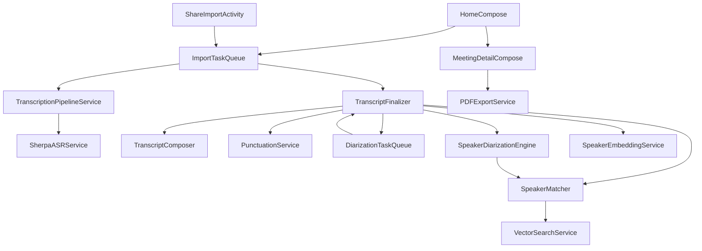

# VoiceBridge Android 项目背景与技术栈

- 平台：Android
- 最低支持版本：Android 8.0+ (API Level 26+ - Oreo)
- 核心语言：Kotlin
- 异步处理：Kotlin Coroutines & Flows
- 依赖注入：Hilt (Dagger-Hilt)
- UI 框架：Jetpack Compose
- 持久化数据库：Jetpack Room

---

# 架构与文件职责说明 (Architecture Documentation)

## 1. 目录结构与职责说明

*   `app/build.gradle.kts` : 声明 compileSdk (34)、minSdk (26)、添加 Room、Hilt、Compose 以及 `sherpa-onnx` SDK 依赖。
*   `app/src/main/AndroidManifest.xml` : 声明前台转写保活服务、系统音频分享接收 Activity，以及录音等必备权限。
*   `app/src/main/java/com/voicebridge/android/data/entity/SupportedLanguage.kt` : 支持语言的枚举定义，带 displayName、国旗 Emoji 以及 Speech Locale。
*   `app/src/main/java/com/voicebridge/android/data/entity/MeetingRecordEntity.kt` : 会议记录持久化 Room 数据表，包含断点续传块索引与 ASR JSON 缓存。
*   `app/src/main/java/com/voicebridge/android/data/entity/TranscriptSegmentEntity.kt` : 转录文字段落表，外键级联指向会议主表（CASCADE）与发言人声纹表（SET_NULL）。
*   `app/src/main/java/com/voicebridge/android/data/entity/SpeakerProfileEntity.kt` : 跨会议声纹指纹特征表，存储 L2 归一化后的 512d 声纹向量。
*   `app/src/main/java/com/voicebridge/android/data/entity/VoiceSampleEntity.kt` : 单场会议提取出的活动声纹样本。
*   `app/src/main/java/com/voicebridge/android/data/entity/AISummaryItemEntity.kt` : 会议关联的多维度 AI 归档项。
*   `app/src/main/java/com/voicebridge/android/data/entity/GlossaryEntryEntity.kt` : 全局自定义词库实体（限制 MAX_ENTRY_COUNT = 200 条）。
*   `app/src/main/java/com/voicebridge/android/data/converter/RoomConverters.kt` : 转换 Date、List<Float> 和 List<String> 以支持 SQLite 存储。
*   `app/src/main/java/com/voicebridge/android/data/relation/MeetingRecordRelations.kt` : 声明一对多联合查询嵌套对象（如 `MeetingRecordComplete`）。
*   `app/src/main/java/com/voicebridge/android/data/dao/VoiceBridgeDaos.kt` : 定义增删改查 DAO 接口，包含 Glossary 限额插入事务。
*   `app/src/main/java/com/voicebridge/android/data/db/VoiceBridgeDatabase.kt` : 汇总注册所有表和类型适配器的数据库实例。
*   `app/src/main/java/com/voicebridge/android/service/AudioDecoder.kt` : 原生 `MediaCodec` 音频解码器，提供 Mono 声道混音与 16kHz 插值降采样。
*   `app/src/main/java/com/voicebridge/android/service/TranscriptComposer.kt` : VAD 静音断句窗口打包、中英文句子标点重整剥离与双指针对齐算法。
*   `app/src/main/java/com/voicebridge/android/service/PunctuationService.kt` : 加载 `punct.int8.onnx` 进行 CT-Transformer 标点恢复。
*   `app/src/main/java/com/voicebridge/android/service/SherpaASRService.kt` : 封装 SenseVoice 推理，配合 Silero VAD 进行长音频流式转录。
*   `app/src/main/java/com/voicebridge/android/service/TranscriptionPipelineService.kt` : 语音转录总控管线，规整 Progress 至 ASR 阶段并拦截非支持语种。
*   `app/src/main/java/com/voicebridge/android/service/ImportTaskQueue.kt` : 利用协程 Mutex 互斥锁提供 FIFO 后台串行转写及落库事务。
*   `app/src/main/java/com/voicebridge/android/service/DiarizationTaskQueue.kt` : Stage B 声纹提取与聚类对齐的后台串行执行队列。
*   `app/src/main/java/com/voicebridge/android/service/TranscriptFinalizer.kt` : 话轮对齐重建总管，实现 ASR 分段落库与 Diarization 质心重归并。
*   `app/src/main/java/com/voicebridge/android/service/VectorSearchService.kt` : 内存余弦相似度计算与 Top-K 快速检索。
*   `app/src/main/java/com/voicebridge/android/service/SpeakerMatcher.kt` : 自适应 AHC 平均链接法聚类与注册一致性验证。
*   `app/src/main/java/com/voicebridge/android/service/SpeakerEmbeddingService.kt` : 提取 CAM++ 512维声纹向量。
*   `app/src/main/java/com/voicebridge/android/service/SpeakerDiarizationEngine.kt` : 封装 pyannote 话轮分割与 Diarization 本地缓存。
*   `app/src/main/java/com/voicebridge/android/service/AssetPackLocator.kt` : 模型存储路径的多路径搜索定位与 Assets 释放。
*   `app/src/main/java/com/voicebridge/android/service/TranscriptionForegroundService.kt` : Status Bar 状态栏常驻前台服务，为大文件转译高保真保活。
*   `app/src/main/java/com/voicebridge/android/service/TranscriptionWorker.kt` : 注册 WorkManager 执行器，在系统闲置时自动轮询入队转写。
*   `app/src/main/java/com/voicebridge/android/service/PDFExportService.kt` : 离屏 WebView 模版渲染加系统的 PrintManager A4 PDF 导出。
*   `app/src/main/java/com/voicebridge/android/ui/ShareImportActivity.kt` : 拦截系统发送 Uri 分享，自动后台复制入库排队。
*   `app/src/main/java/com/voicebridge/android/ui/HomeCompose.kt` : Compose 绘制双 Tab 主面板（纪要列表 + 文件导入去重）。
*   `app/src/main/java/com/voicebridge/android/ui/MeetingDetailCompose.kt` : 详情页：MediaPlayer 控制、逐字稿播放定位与双击跳转、声纹跨会议重命名。
*   `app/src/main/java/com/voicebridge/android/ui/theme/Theme.kt` : 自定义自适应明暗明暗设计令牌、Okabe-Ito 8色色盲安全调色板与 Compose Theme 包装器。

---

## 2. 核心模块依赖关系

